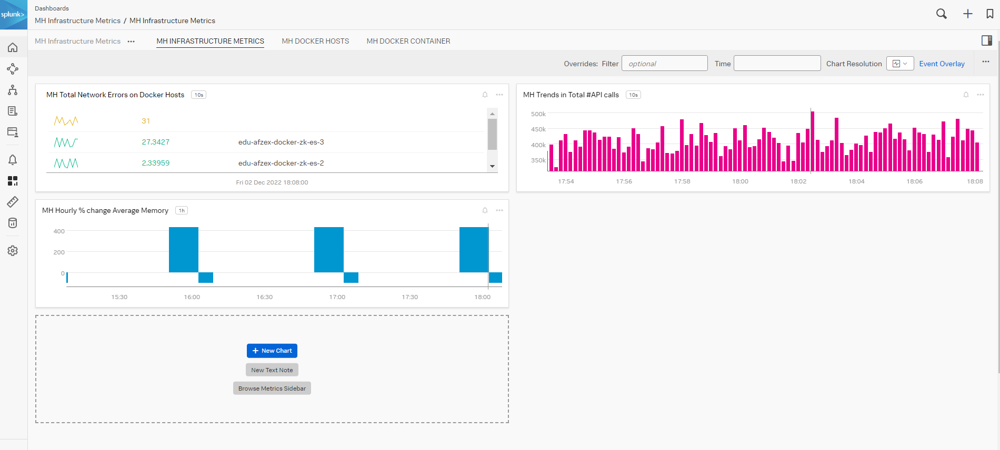
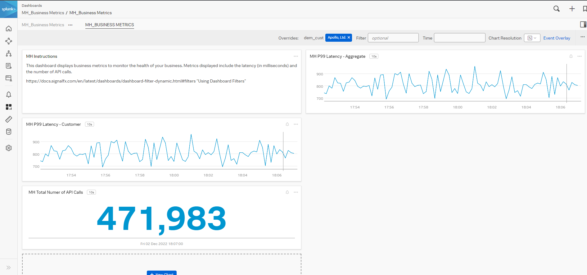
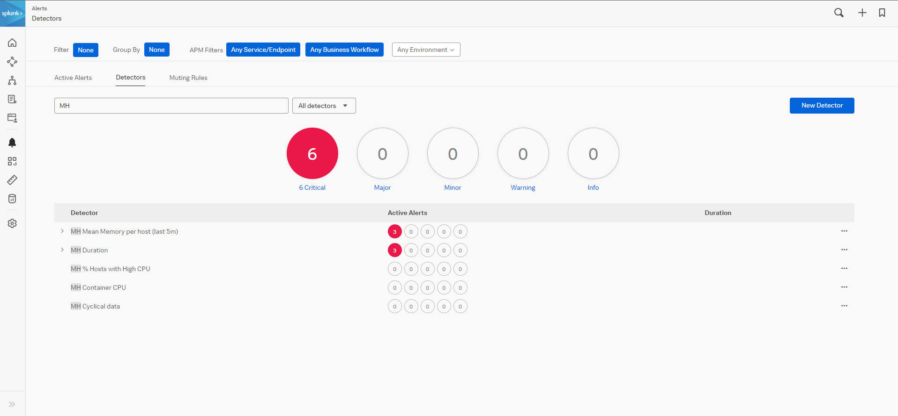
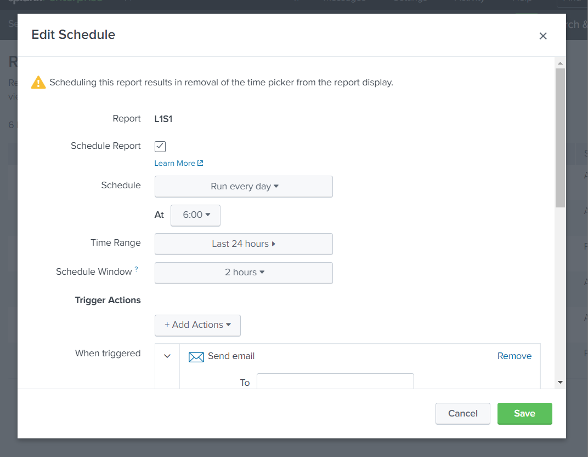
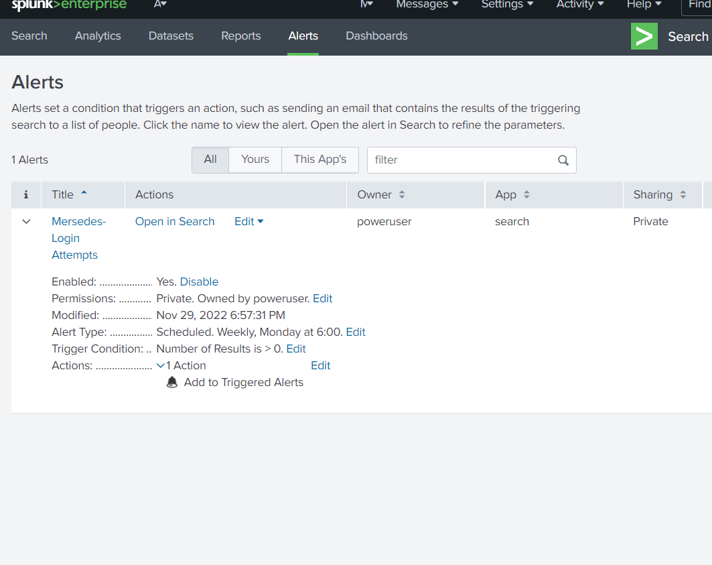
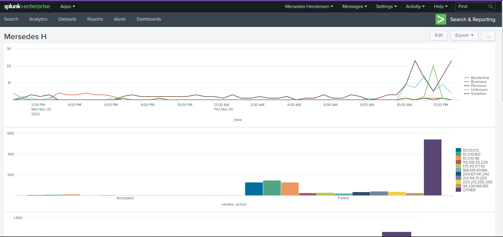

# Splunk-Portfolio

"What is <strong>Splunk?</strong>"

<strong>Splunk</strong> is a data platform that reads, processes and monitors data for any size business.

This is the official <strong>SPLUNK</strong> documentation for more information: https://www.splunk.com/en_us/about-us/why-splunk.html

<h1>Splunk Infastructure Monitoring</h1>

<h3>Detections and Dashboards within the Splunk IM platform</h3>

<h1> Splunk Enterprise</h1>
<h3>Data Models</h3>
  

  
  
  
  
  

<h3>Scheduled Alert and Reports</h3>

