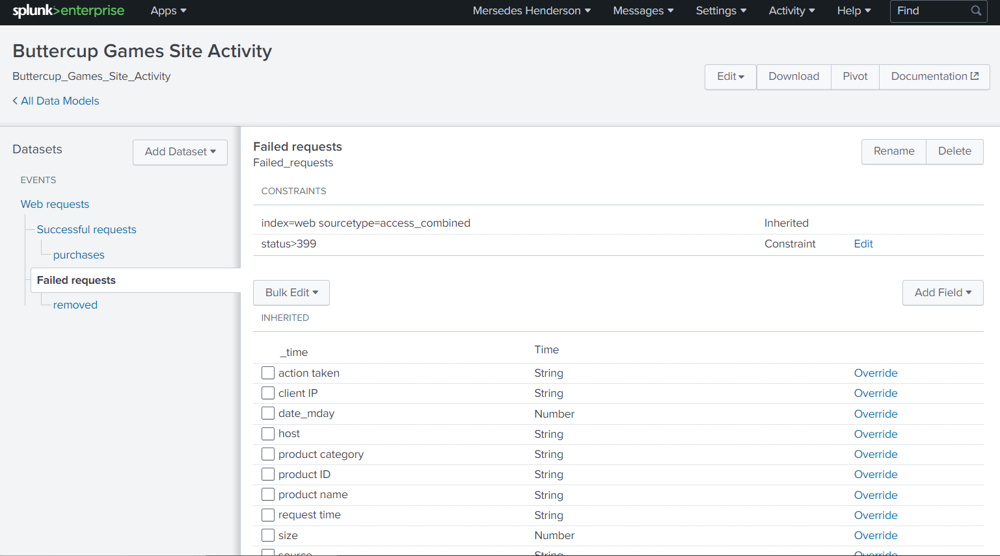
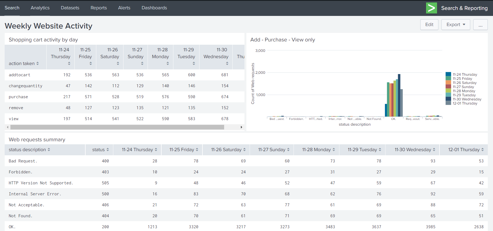
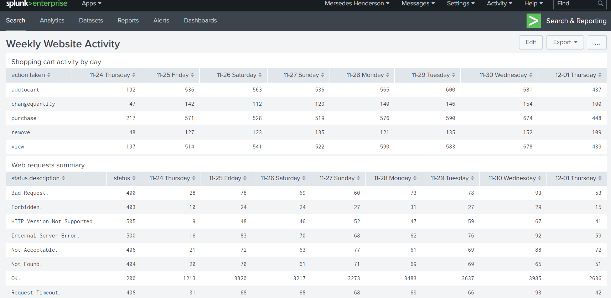
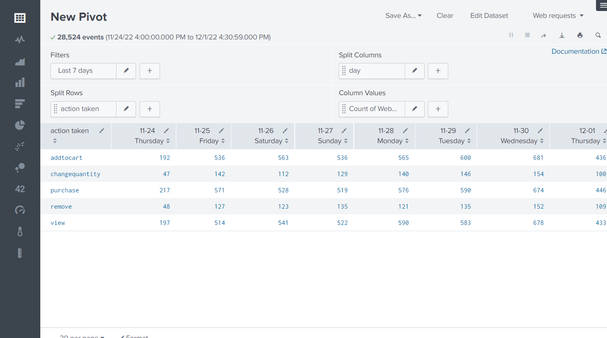
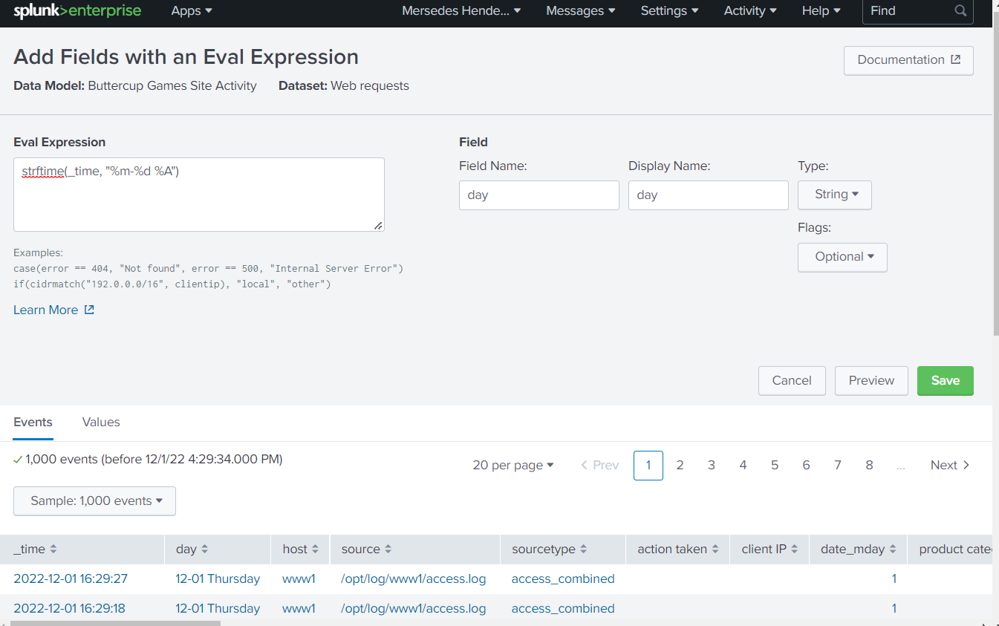

# Splunk-Visualizations

Easy to read portfolio of my SPLUNK course work and labs.

This is the official <strong>SPLUNK</strong> documentation for better reference.

https://docs.splunk.com/Documentation/Splunk/9.0.2/SearchReference/WhatsInThisManual

<h1>Splunk Infastructure Monitoring</h1>

<h3>Detections and Dashboards with in the Splunk IM platform

  
   
    

  
  

  

  <h1>Data Models</h1>
  

  
  
  
  
  
